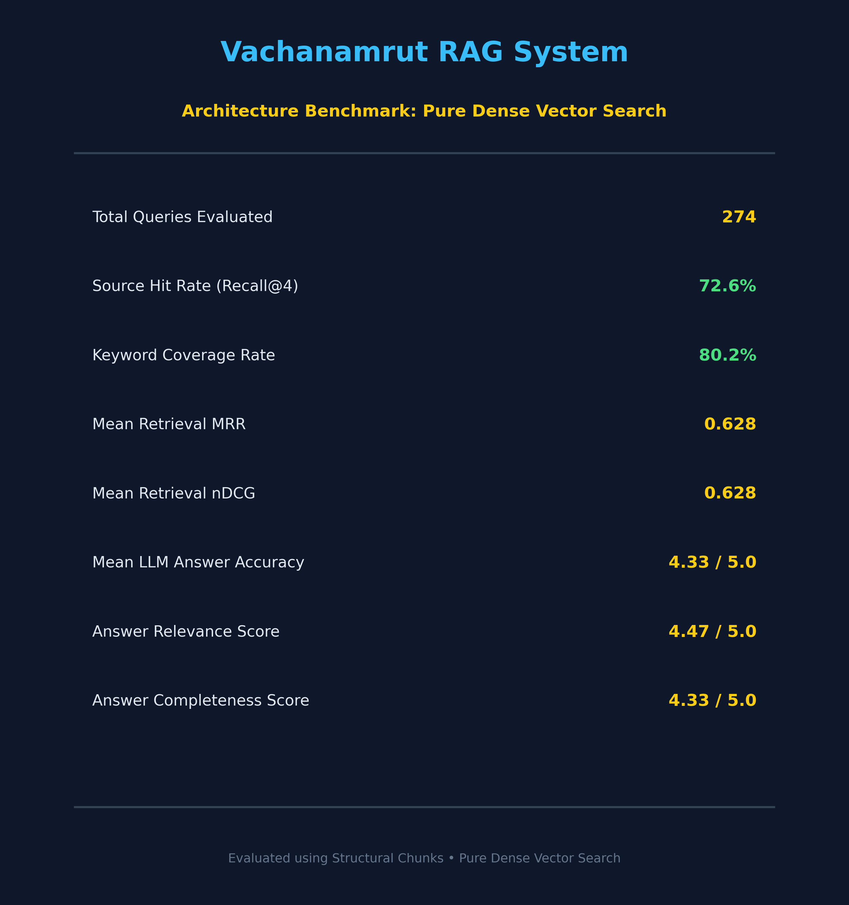
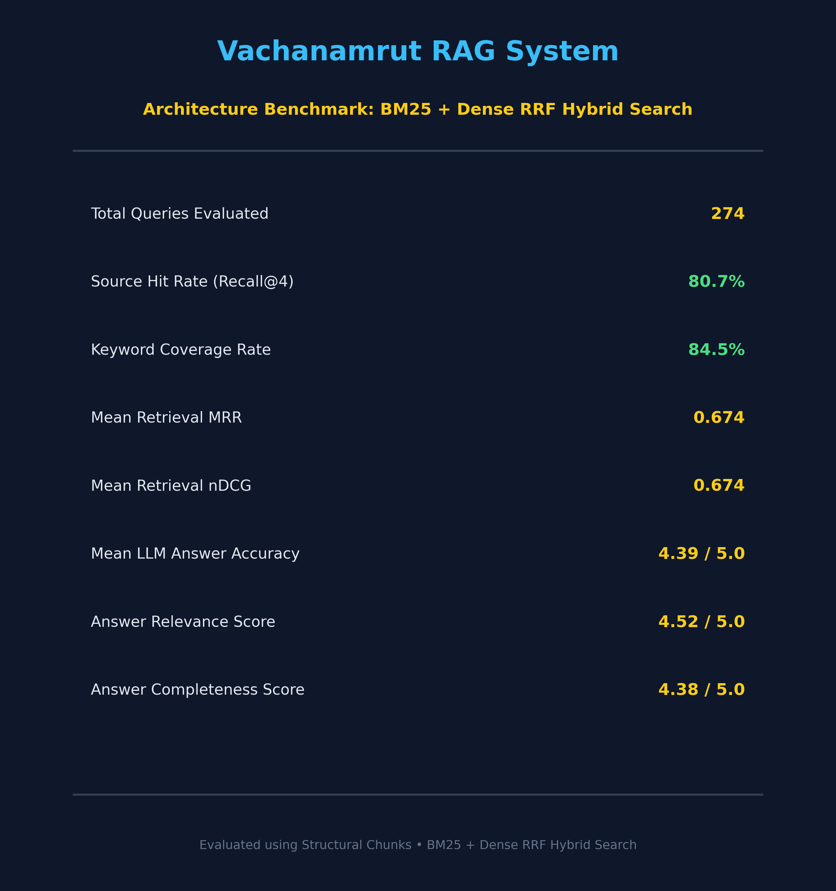
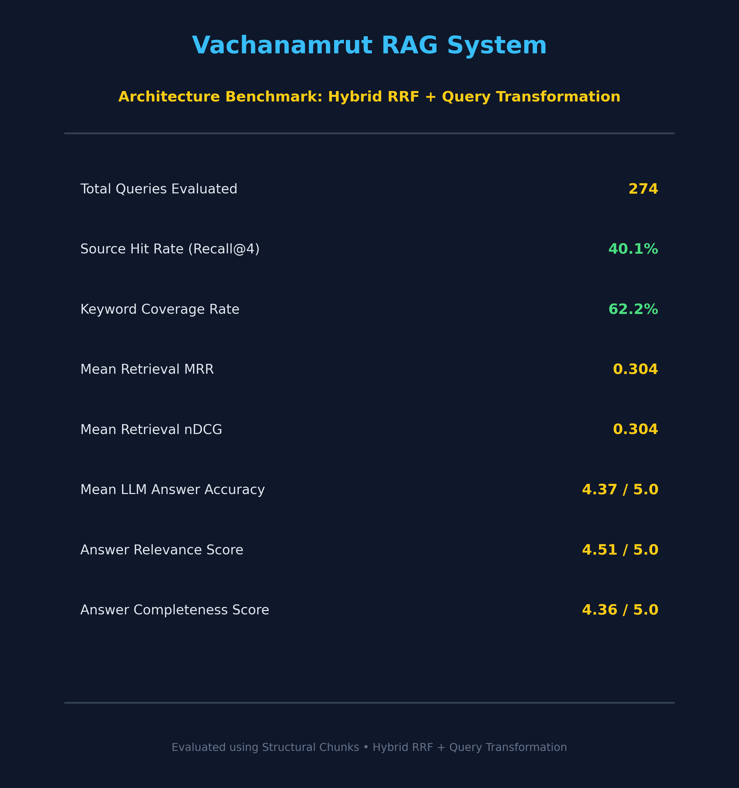

# Vachanamrut Hybrid RAG Pipeline

A production-grade, modular Retrieval-Augmented Generation (RAG) system built to query the sacred Vachanamrut text. 
This project compares standard dense vector retrieval against a hybrid system (Dense + Sparse BM25), featuring dynamic query expansion and an automated LLM-as-a-Judge evaluation framework.

## 📌 Features

* **Hybrid Retrieval:** Integrates ChromaDB (dense semantic search) with BM25 (sparse keyword search) to maximize recall and precision.
* **Query Transformation:** Expands user queries dynamically to catch complex or ambiguous phrasing across spiritual contexts.
* **Automated Evaluation:** Evaluates retrieval depth, answer faithfulness, and context relevance using `gemini-1.5-flash` as a judge.
* **Modular Codebase:** Organized into clean, reproducible steps from raw web scraping to final scorecard generation.


<br/><br/>

<br/><br/>


## 📁 Repository Structure

```text
├── data/                    # Raw & processed markdown files (DBs ignored in git)
├── interactive notebooks/    # Prototyping & exploratory analysis
├── results/                 # Evaluation scorecards and benchmark outputs
├── src/
│   ├── config.py            # Centralized directory & hyperparameter config
│   ├── step1_scraper.py     # Web scraping pipeline
│   ├── step2_parser.py      # Markdown parsing and cleaning
│   ├── step3a_chunker_recursive.py
│   ├── step3b_chunker_structural.py
│   ├── step4_retriever.py   # ChromaDB + BM25 hybrid setup
│   ├── step5_query_transform.py
│   ├── step6_pipeline.py    # End-to-end execution script
│   ├── step7_make_dataset.py
│   ├── step8_evals_dense.py
│   ├── step8_evals_hybrid.py
│   └── step9_generate_scorecard.py
├── app.py                   # Gradio / Web interface setup
├── pyproject.toml           # Environment setup via uv
└── README.md
